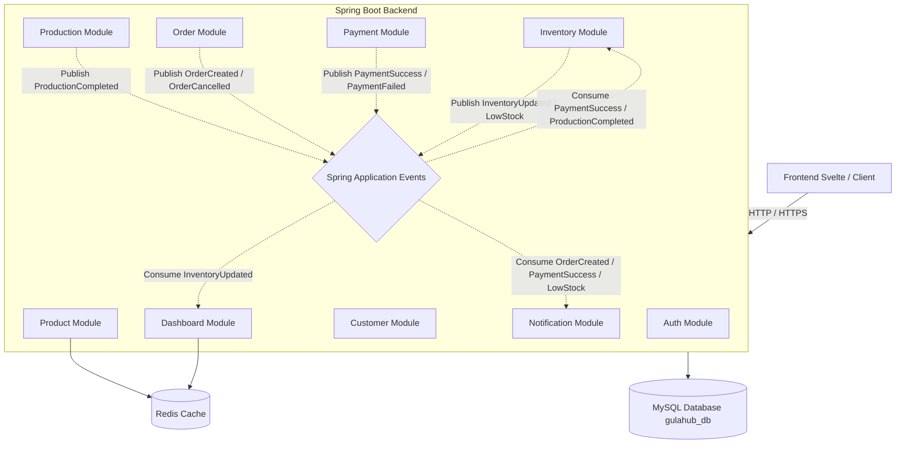

# TECHNICAL REQUIREMENTS DOCUMENT (TRD)
## Gula Management System (GulaHub) v1.0 (Monolith Version)
**Status:** DRAFT | **Version:** 1.0 (Monolith) | **Date:** 2026-06-12

---

## 1. PENDAHULUAN & ARSITEKTUR SISTEM

Dokumen Persyaratan Teknis (TRD) ini mendefinisikan spesifikasi arsitektur, skema database, API, komunikasi event internal, caching, dan keamanan untuk **Gula Management System (GulaHub)** versi Monolith.

### 1.1 Arsitektur Tingkat Tinggi (High-Level Architecture)
Sistem ini menggunakan arsitektur **Modular Monolith** berbasis **Spring Boot** di mana semua modul bisnis berjalan dalam satu proses JVM yang sama. Pemisahan antar modul dilakukan secara logis pada level package/module Spring Boot untuk menjaga agar sistem tetap bersih (loosely coupled) dan mudah di-maintain. 

Komunikasi antar modul yang bersifat asynchronous memanfaatkan **Spring Application Events** (pengganti Apache Kafka). Caching data statis/dashboard menggunakan **Redis**. Seluruh modul menggunakan satu database MySQL yang sama (`gulahub_db`).



### 1.2 Lingkungan Teknologi (Technology Stack)
*   **Backend Application:** Java 17, Spring Boot 3.x, Spring Data JPA, Spring Security
*   **Database:** MySQL 8.0 (Single Database Schema dengan referential integrity / foreign keys)
*   **Cache & Session:** Redis 7.x
*   **Internal Event Bus:** Spring Application Events (`ApplicationEventPublisher` & `@EventListener` / `@TransactionalEventListener`)
*   **Security:** JWT (JSON Web Token), Spring Security, BCrypt Hashing
*   **Containerization:** Docker & Docker Compose
*   **Frontend:** Svelte, Vite

---

## 2. DATABASE SCHEMA DESIGN

Berbeda dengan versi microservices yang memisahkan database secara fisik, versi monolith ini menggunakan satu database terpadu (`gulahub_db`). Hal ini memungkinkan penerapan **Foreign Key Constraints** secara langsung untuk menjamin integritas data (referential integrity).

### 2.1 Skema Tabel (Database Terpadu `gulahub_db`)

#### 2.1.1 Modul Auth
*   **Table: `users`**
    *   `id` (VARCHAR(36) / BINARY(16), PK) - UUID
    *   `username` (VARCHAR(50), Unique, Not Null)
    *   `email` (VARCHAR(100), Unique, Not Null)
    *   `password` (VARCHAR(255), Not Null) - BCrypt Hashed
    *   `role` (ENUM('OWNER', 'ADMIN_GUDANG', 'ADMIN_PENJUALAN'), Not Null)
    *   `created_at` (TIMESTAMP)

#### 2.1.2 Modul Product
*   **Table: `products`**
    *   `id` (VARCHAR(36) / BINARY(16), PK) - UUID
    *   `code` (VARCHAR(50), Unique, Not Null)
    *   `name` (VARCHAR(100), Not Null)
    *   `category` (VARCHAR(50), Not Null)
    *   `description` (TEXT)
    *   `price` (DECIMAL(12,2), Not Null)
    *   `weight` (DECIMAL(6,2), Not Null) - berat dalam kg
    *   `image_url` (VARCHAR(255))
    *   `status` (BOOLEAN, Not Null, Default true)
    *   `created_at` (TIMESTAMP)

#### 2.1.3 Modul Inventory
*   **Table: `inventories`**
    *   `id` (VARCHAR(36) / BINARY(16), PK) - UUID
    *   `product_id` (VARCHAR(36) / BINARY(16), Unique, Not Null) -> FK ke `products.id`
    *   `current_stock` (INT, Not Null, Default 0)
    *   `minimum_stock` (INT, Not Null, Default 10)
    *   `updated_at` (TIMESTAMP)
*   **Table: `stock_movements`**
    *   `id` (VARCHAR(36) / BINARY(16), PK) - UUID
    *   `inventory_id` (VARCHAR(36) / BINARY(16), Not Null) -> FK ke `inventories.id`
    *   `movement_type` (ENUM('IN', 'OUT', 'ADJUSTMENT'), Not Null)
    *   `quantity` (INT, Not Null)
    *   `reference_type` (ENUM('production', 'order', 'manual', 'adjustment'), Not Null)
    *   `reference_id` (VARCHAR(36) / BINARY(16)) - ID dokumen terkait (Production ID atau Order ID)
    *   `notes` (TEXT)
    *   `created_at` (TIMESTAMP)

#### 2.1.4 Modul Production
*   **Table: `productions`**
    *   `id` (VARCHAR(36) / BINARY(16), PK) - UUID
    *   `product_id` (VARCHAR(36) / BINARY(16), Not Null) -> FK ke `products.id`
    *   `quantity` (INT, Not Null)
    *   `production_date` (DATE, Not Null)
    *   `notes` (TEXT)
    *   `created_at` (TIMESTAMP)

#### 2.1.5 Modul Customer
*   **Table: `customers`**
    *   `id` (VARCHAR(36) / BINARY(16), PK) - UUID
    *   `name` (VARCHAR(100), Not Null)
    *   `phone_number` (VARCHAR(20), Not Null)
    *   `email` (VARCHAR(100))
    *   `address` (TEXT)
    *   `created_at` (TIMESTAMP)

#### 2.1.6 Modul Order
*   **Table: `orders`**
    *   `id` (VARCHAR(36) / BINARY(16), PK) - UUID
    *   `customer_id` (VARCHAR(36) / BINARY(16), Not Null) -> FK ke `customers.id`
    *   `order_date` (TIMESTAMP, Not Null)
    *   `total_amount` (DECIMAL(12,2), Not Null)
    *   `status` (ENUM('CREATED', 'PAID', 'PACKED', 'SHIPPED', 'COMPLETED', 'CANCELLED'), Not Null)
*   **Table: `order_items`**
    *   `id` (VARCHAR(36) / BINARY(16), PK) - UUID
    *   `order_id` (VARCHAR(36) / BINARY(16), Not Null) -> FK ke `orders.id`
    *   `product_id` (VARCHAR(36) / BINARY(16), Not Null) -> FK ke `products.id`
    *   `product_name` (VARCHAR(100), Not Null)
    *   `price` (DECIMAL(12,2), Not Null)
    *   `quantity` (INT, Not Null)
    *   `subtotal` (DECIMAL(12,2), Not Null)

#### 2.1.7 Modul Payment
*   **Table: `payments`**
    *   `id` (VARCHAR(36) / BINARY(16), PK) - UUID
    *   `order_id` (VARCHAR(36) / BINARY(16), Unique, Not Null) -> FK ke `orders.id`
    *   `amount` (DECIMAL(12,2), Not Null)
    *   `payment_method` (ENUM('CASH', 'BANK_TRANSFER', 'OTHER'), Not Null)
    *   `status` (ENUM('PENDING', 'SUCCESS', 'FAILED'), Not Null)
    *   `payment_date` (TIMESTAMP)
    *   `created_at` (TIMESTAMP)

#### 2.1.8 Modul Notification
*   **Table: `notification_histories`**
    *   `id` (VARCHAR(36) / BINARY(16), PK) - UUID
    *   `recipient` (VARCHAR(100), Not Null) - Email / No. Telp
    *   `type` (ENUM('LOW_STOCK', 'ORDER_CREATED', 'PAYMENT_SUCCESS'), Not Null)
    *   `message` (TEXT, Not Null)
    *   `status` (ENUM('SENT', 'FAILED'), Not Null)
    *   `sent_at` (TIMESTAMP)

---

## 3. SPESIFIKASI ENDPOINT API (LENGKAP)

Semua REST API menggunakan format JSON untuk request dan response. Karena sistem ini merupakan monolith, tidak diperlukan API Gateway terpisah. Semua modul diekspos langsung dari server backend Spring Boot (port default `8080`) di bawah path prefix `/api/v1/`.

Endpoint yang membutuhkan autentikasi harus mengirim header: `Authorization: Bearer <JWT_TOKEN>`.

### 3.1 Rangkuman Path Endpoint
*   `/api/v1/auth/**` -> Diarahkan ke Auth Controller
*   `/api/v1/products/**` -> Diarahkan ke Product Controller
*   `/api/v1/inventories/**` -> Diarahkan ke Inventory Controller
*   `/api/v1/productions/**` -> Diarahkan ke Production Controller
*   `/api/v1/customers/**` -> Diarahkan ke Customer Controller
*   `/api/v1/orders/**` -> Diarahkan ke Order Controller
*   `/api/v1/payments/**` -> Diarahkan ke Payment Controller
*   `/api/v1/notifications/**` -> Diarahkan ke Notification Controller
*   `/api/v1/dashboard/**` -> Diarahkan ke Dashboard Controller

---

### 3.2 Auth (Endpoint Otentikasi)

#### 3.2.1 Register User Baru
*   **Method / Path:** `POST /api/v1/auth/register`
*   **Akses:** Public / Khusus Owner
*   **Request Body:**
    ```json
    {
      "username": "admingudang1",
      "email": "gudang1@gulahub.com",
      "password": "SecretPassword123",
      "role": "ADMIN_GUDANG"
    }
    ```
*   **Response (201 Created):**
    ```json
    {
      "id": "e8c8942b-5b5c-48c2-8c1d-12b2e8c8942b",
      "username": "admingudang1",
      "role": "ADMIN_GUDANG",
      "message": "User registered successfully"
    }
    ```

#### 3.2.2 Login User
*   **Method / Path:** `POST /api/v1/auth/login`
*   **Akses:** Public
*   **Request Body:**
    ```json
    {
      "username": "admingudang1",
      "password": "SecretPassword123"
    }
    ```
*   **Response (200 OK):**
    ```json
    {
      "accessToken": "eyJhbGciOiJIUzI1NiIsInR5...",
      "tokenType": "Bearer",
      "expiresIn": 86400,
      "role": "ADMIN_GUDANG"
    }
    ```

---

### 3.3 Product (Endpoint Katalog Produk)

#### 3.3.1 List Products (Paginated & Filtered)
*   **Method / Path:** `GET /api/v1/products`
*   **Akses:** Owner, Admin Gudang, Admin Penjualan
*   **Query Params:** `page` (default: 0), `size` (default: 10), `q` (search, optional), `category` (optional)
*   **Response (200 OK):**
    ```json
    {
      "data": [
        {
          "id": "550e8400-e29b-41d4-a716-446655440001",
          "code": "P001",
          "name": "Gula Aren 250gr",
          "category": "Gula Aren",
          "price": 20000.00,
          "weight": 0.25,
          "imageUrl": "https://gulahub-bucket.s3.amazonaws.com/gula_aren_250.jpg",
          "status": true
        }
      ],
      "page": 0,
      "size": 10,
      "totalElements": 1,
      "totalPages": 1
    }
    ```

#### 3.3.2 Get Product Detail
*   **Method / Path:** `GET /api/v1/products/{id}`
*   **Akses:** Owner, Admin Gudang, Admin Penjualan
*   **Response (200 OK):**
    ```json
    {
      "id": "550e8400-e29b-41d4-a716-446655440001",
      "code": "P001",
      "name": "Gula Aren 250gr",
      "category": "Gula Aren",
      "description": "Gula aren murni berkualitas tinggi kemasan 250 gram",
      "price": 20000.00,
      "weight": 0.25,
      "imageUrl": "https://gulahub-bucket.s3.amazonaws.com/gula_aren_250.jpg",
      "status": true
    }
    ```

#### 3.3.3 Create Product
*   **Method / Path:** `POST /api/v1/products`
*   **Akses:** Owner
*   **Request Body:**
    ```json
    {
      "code": "P002",
      "name": "Gula Kelapa 500gr",
      "category": "Gula Kelapa",
      "description": "Gula kelapa cetak alami kemasan 500 gram",
      "price": 35000.00,
      "weight": 0.50,
      "imageUrl": "https://gulahub-bucket.s3.amazonaws.com/gula_kelapa_500.jpg",
      "status": true
    }
    ```
*   **Response (201 Created):**
    ```json
    {
      "id": "550e8400-e29b-41d4-a716-446655440004",
      "code": "P002",
      "message": "Product created successfully"
    }
    ```
*   **Cache Invalidation:** Evict cache list `products` pada Redis.

#### 3.3.4 Update Product
*   **Method / Path:** `PUT /api/v1/products/{id}`
*   **Akses:** Owner
*   **Request Body:** (Sama dengan format Create)
*   **Response (200 OK):**
    ```json
    {
      "id": "550e8400-e29b-41d4-a716-446655440001",
      "message": "Product updated successfully"
    }
    ```
*   **Cache Invalidation:** Evict cache detail `product:{id}` dan cache list `products`.

#### 3.3.5 Delete Product (Soft Delete / Penonaktifan)
*   **Method / Path:** `DELETE /api/v1/products/{id}`
*   **Akses:** Owner
*   **Response (204 No Content):** (No body)
*   **Cache Invalidation:** Evict cache detail `product:{id}` dan cache list `products`.

---

### 3.4 Inventory (Endpoint Pengelolaan Stok)

#### 3.4.1 Get Inventory by Product ID
*   **Method / Path:** `GET /api/v1/inventories/product/{productId}`
*   **Akses:** Owner, Admin Gudang
*   **Response (200 OK):**
    ```json
    {
      "id": "550e8400-e29b-41d4-a716-446655440006",
      "productId": "550e8400-e29b-41d4-a716-446655440001",
      "currentStock": 85,
      "minimumStock": 10,
      "updatedAt": "2026-06-10T10:15:30Z"
    }
    ```

#### 3.4.2 Stock In (Penambahan Manual)
*   **Method / Path:** `POST /api/v1/inventories/{inventoryId}/in`
*   **Akses:** Admin Gudang
*   **Request Body:**
    ```json
    {
      "quantity": 50,
      "notes": "Penyesuaian stok masuk manual dari kebun luar"
    }
    ```
*   **Response (200 OK):**
    ```json
    {
      "inventoryId": "550e8400-e29b-41d4-a716-446655440006",
      "previousStock": 85,
      "newStock": 135,
      "message": "Stock added successfully"
    }
    ```
*   **Event Emitted:** Memicu event internal `InventoryUpdatedEvent` via `ApplicationEventPublisher`.

#### 3.4.3 Stock Out (Pengurangan Manual / Kerusakan)
*   **Method / Path:** `POST /api/v1/inventories/{inventoryId}/out`
*   **Akses:** Admin Gudang
*   **Request Body:**
    ```json
    {
      "quantity": 5,
      "notes": "Gula rusak / digigit tikus"
    }
    ```
*   **Response (200 OK):**
    ```json
    {
      "inventoryId": "550e8400-e29b-41d4-a716-446655440006",
      "previousStock": 135,
      "newStock": 130,
      "message": "Stock reduced successfully"
    }
    ```
*   **Event Emitted:** `InventoryUpdatedEvent`. Jika stok di bawah batas minimum, emit `LowStockEvent`.

#### 3.4.4 Adjust Stock (Stock Opname)
*   **Method / Path:** `POST /api/v1/inventories/{inventoryId}/adjust`
*   **Akses:** Admin Gudang, Owner
*   **Request Body:**
    ```json
    {
      "quantity": -2,
      "notes": "Hasil Stock Opname Juni 2026"
    }
    ```
*   **Response (200 OK):**
    ```json
    {
      "inventoryId": "550e8400-e29b-41d4-a716-446655440006",
      "previousStock": 130,
      "newStock": 128,
      "message": "Stock adjusted successfully"
    }
    ```

#### 3.4.5 Get Inventory Transaction History
*   **Method / Path:** `GET /api/v1/inventories/{inventoryId}/transactions`
*   **Akses:** Owner, Admin Gudang
*   **Query Params:** `page`, `size`
*   **Response (200 OK):**
    ```json
    {
      "data": [
        {
          "id": "f8c8942b-5b5c-48c2-8c1d-12b2e8c8942c",
          "movementType": "OUT",
          "quantity": 2,
          "referenceType": "order",
          "referenceId": "550e8400-e29b-41d4-a716-446655440002",
          "notes": "Payment confirmed",
          "createdAt": "2026-06-04T11:05:00Z"
        }
      ],
      "page": 0,
      "size": 10,
      "total": 1
    }
    ```

---

### 3.5 Production (Endpoint Hasil Produksi)

#### 3.5.1 Create Production Record
*   **Method / Path:** `POST /api/v1/productions`
*   **Akses:** Admin Gudang
*   **Request Body:**
    ```json
    {
      "productId": "550e8400-e29b-41d4-a716-446655440001",
      "quantity": 150,
      "productionDate": "2026-06-10",
      "notes": "Batch Pagi - Pengolahan Nira Aren Desa Karangsari"
    }
    ```
*   **Response (201 Created):**
    ```json
    {
      "productionId": "349ae8c8-1111-48c2-8c1d-12b2e8c89abc",
      "message": "Production record created, event published for inventory update."
    }
    ```
*   **Event Emitted:** `ProductionCompletedEvent` dikirim secara internal. Modul Inventory akan menerima event ini untuk menambahkan stok secara otomatis.

#### 3.5.2 List Production History
*   **Method / Path:** `GET /api/v1/productions`
*   **Akses:** Owner, Admin Gudang
*   **Query Params:** `productId` (optional), `startDate` (optional), `endDate` (optional), `page`, `size`
*   **Response (200 OK):** Daftar riwayat produksi paginated.

---

### 3.6 Customer (Endpoint Pelanggan)

#### 3.6.1 Create Customer
*   **Method / Path:** `POST /api/v1/customers`
*   **Akses:** Admin Penjualan, Owner
*   **Request Body:**
    ```json
    {
      "name": "Budi Santoso",
      "phoneNumber": "081234567890",
      "email": "budi.santoso@gmail.com",
      "address": "Jl. Slamet Riyadi No. 45, Solo, Jawa Tengah"
    }
    ```
*   **Response (201 Created):**
    ```json
    {
      "id": "890f8400-e29b-41d4-a716-446655440099",
      "message": "Customer registered successfully"
    }
    ```

#### 3.6.2 Update Customer
*   **Method / Path:** `PUT /api/v1/customers/{id}`
*   **Akses:** Admin Penjualan, Owner
*   **Request Body:** (Sama dengan format Create)
*   **Response (200 OK):**
    ```json
    {
      "id": "890f8400-e29b-41d4-a716-446655440099",
      "message": "Customer updated successfully"
    }
    ```

#### 3.6.3 List Customers
*   **Method / Path:** `GET /api/v1/customers`
*   **Akses:** Owner, Admin Penjualan
*   **Query Params:** `q` (search, optional), `page`, `size`
*   **Response (200 OK):** Daftar master pelanggan.

#### 3.6.4 Get Customer by ID
*   **Method / Path:** `GET /api/v1/customers/{id}`
*   **Akses:** Owner, Admin Penjualan
*   **Response (200 OK):** Detail data pelanggan.

---

### 3.7 Order (Endpoint Pemesanan)

#### 3.7.1 Create Order
*   **Method / Path:** `POST /api/v1/orders`
*   **Akses:** Admin Penjualan
*   **Request Body:**
    ```json
    {
      "customerId": "890f8400-e29b-41d4-a716-446655440099",
      "items": [
        {
          "productId": "550e8400-e29b-41d4-a716-446655440001",
          "productName": "Gula Aren 250gr",
          "price": 20000.00,
          "quantity": 2
        }
      ]
    }
    ```
*   **Behavior (Alur Eksekusi):**
    1. Sistem memanggil `InventoryModule` secara internal (Spring Bean invocation) untuk memverifikasi kecukupan stok secara real-time.
    2. Jika stok tidak mencukupi, lempar Exception yang akan diterjemahkan menjadi response `400 Bad Request`.
    3. Jika stok cukup, simpan data order ke database dengan status `CREATED`.
    4. Hitung total harga otomatis (Subtotal per item + Total Amount).
    5. Emit `OrderCreatedEvent` secara internal untuk memicu pencatatan log notifikasi.
*   **Response (201 Created):**
    ```json
    {
      "orderId": "550e8400-e29b-41d4-a716-446655440002",
      "status": "CREATED",
      "totalAmount": 40000.00,
      "message": "Order created successfully"
    }
    ```

#### 3.7.2 Get Order by ID
*   **Method / Path:** `GET /api/v1/orders/{id}`
*   **Akses:** Owner, Admin Penjualan
*   **Response (200 OK):**
    ```json
    {
      "id": "550e8400-e29b-41d4-a716-446655440002",
      "customerId": "890f8400-e29b-41d4-a716-446655440099",
      "orderDate": "2026-06-10T10:15:00Z",
      "totalAmount": 40000.00,
      "status": "CREATED",
      "items": [
        {
          "id": "78901234-e29b-41d4-a716-446655440123",
          "productId": "550e8400-e29b-41d4-a716-446655440001",
          "productName": "Gula Aren 250gr",
          "price": 20000.00,
          "quantity": 2,
          "subtotal": 40000.00
        }
      ]
    }
    ```

#### 3.7.3 Update Order Status
*   **Method / Path:** `PATCH /api/v1/orders/{id}/status`
*   **Akses:** Admin Penjualan, Owner
*   **Request Body:**
    ```json
    {
      "status": "PACKED"
    }
    ```
*   **Response (200 OK):**
    ```json
    {
      "orderId": "550e8400-e29b-41d4-a716-446655440002",
      "status": "PACKED",
      "message": "Order status updated successfully"
    }
    ```

#### 3.7.4 List Orders
*   **Method / Path:** `GET /api/v1/orders`
*   **Akses:** Owner, Admin Penjualan
*   **Query Params:** `status` (optional), `page`, `size`
*   **Response (200 OK):** Daftar order ter-paginasi.

---

### 3.8 Payment (Endpoint Pembayaran)

#### 3.8.1 Initiate Payment (Membuat Tagihan)
*   **Method / Path:** `POST /api/v1/payments`
*   **Akses:** Admin Penjualan (bisa dipicu otomatis atau manual)
*   **Request Body:**
    ```json
    {
      "orderId": "550e8400-e29b-41d4-a716-446655440002",
      "paymentMethod": "BANK_TRANSFER",
      "amount": 40000.00
    }
    ```
*   **Response (201 Created):**
    ```json
    {
      "paymentId": "550e8400-e29b-41d4-a716-446655440005",
      "status": "PENDING"
    }
    ```

#### 3.8.2 Confirm Payment (Penyelesaian Pembayaran)
*   **Method / Path:** `POST /api/v1/payments/{id}/confirm`
*   **Akses:** Admin Penjualan
*   **Request Body:**
    ```json
    {
      "status": "SUCCESS",
      "paymentDate": "2026-06-10T10:20:00Z"
    }
    ```
*   **Behavior (Alur Eksekusi):**
    1. Update status pembayaran menjadi `SUCCESS` di database `payments`.
    2. Emit event `PaymentSuccessEvent` ke event publisher internal.
    3. `InventoryModule` mendengarkan event ini dan memotong stok di database `inventories` secara lokal.
    4. `NotificationModule` mendengarkan event ini untuk mencatat log pengiriman notifikasi sukses bayar.
*   **Response (200 OK):**
    ```json
    {
      "paymentId": "550e8400-e29b-41d4-a716-446655440005",
      "status": "SUCCESS",
      "message": "Payment confirmed and event published."
    }
    ```

#### 3.8.3 Get Payment by Order ID
*   **Method / Path:** `GET /api/v1/payments/order/{orderId}`
*   **Akses:** Owner, Admin Penjualan
*   **Response (200 OK):** Detail data pembayaran.

---

### 3.9 Notification (Endpoint Log Notifikasi)

#### 3.9.1 List Sent Notifications (Audit Log)
*   **Method / Path:** `GET /api/v1/notifications`
*   **Akses:** Owner
*   **Query Params:** `page`, `size`
*   **Response (200 OK):** Riwayat log pengiriman notifikasi ter-paginasi.

#### 3.9.2 Send Test Notification
*   **Method / Path:** `POST /api/v1/notifications/test`
*   **Akses:** Owner
*   **Request Body:**
    ```json
    {
      "type": "LOW_STOCK",
      "message": "TEST: Stok Gula Aren menipis",
      "recipient": "owner@gulahub.com"
    }
    ```
*   **Response (200 OK):**
    ```json
    {
      "message": "Test notification sent successfully"
    }
    ```

---

### 3.10 Dashboard (Endpoint Statistik)

#### 3.10.1 Get Dashboard Summary
*   **Method / Path:** `GET /api/v1/dashboard/summary`
*   **Akses:** Owner
*   **Behavior (Alur Eksekusi):**
    *   Membaca data teragregasi dari cache Redis key `dashboard_summary`.
    *   Jika cache miss, jalankan query agregasi langsung ke database `gulahub_db` (tabel products, inventories, orders, payments), simpan ke Redis cache dengan TTL 5 menit, dan kembalikan datanya.
*   **Response (200 OK):** (Struktur data agregasi penjualan, stok kritis, produk terlaris, dan pesanan terbaru sama persis dengan versi microservices).

---

## 4. STRATEGI CACHING (REDIS)

Redis digunakan dalam Spring Boot monolith melalui Spring Cache abstraction (`@Cacheable`, `@CacheEvict`) untuk meningkatkan performa respon API dan menghemat resource CPU database.

### 4.1 Desain Key Redis & TTL

| Fitur | Key Pattern | Tipe Data | TTL | Kebijakan Invalidation (Evict) |
|---|---|---|---|---|
| **Daftar Produk** | `products` | String / JSON | 10 Menit | Dihapus (Evict) otomatis ketika terjadi Create / Update / Delete produk di `ProductModule` |
| **Detail Produk** | `product:{id}` | String / JSON | 10 Menit | Dihapus otomatis saat terdeteksi Update / Delete pada `{id}` produk terkait |
| **Ringkasan Dashboard** | `dashboard_summary` | String / JSON | 5 Menit | Di-evict secara otomatis ketika event `InventoryUpdatedEvent` atau `PaymentSuccessEvent` diproses oleh `DashboardModule` |

---

## 5. SPRING APPLICATION EVENT ARCHITECTURE (INTERNAL EVENT BUS)

Seluruh komunikasi asinkronus dan decoupled antar-modul internal backend diimplementasikan menggunakan **Spring Application Events** (ApplicationContext Event-driven mechanism). Ini menggantikan dependency terhadap external broker Kafka.

### 5.1 Mekanisme Event
*   **Publisher:** Menggunakan `ApplicationEventPublisher.publishEvent(Object event)`.
*   **Listeners:** Menggunakan `@EventListener` untuk event standar atau `@TransactionalEventListener(phase = TransactionPhase.AFTER_COMMIT)` untuk event yang harus dieksekusi hanya jika transaksi database saat ini berhasil melakukan komit.
*   **Asynchronous:** Menambahkan anotasi `@Async` pada method listener (memerlukan `@EnableAsync` pada konfigurasi aplikasi) untuk mengeksekusi proses di background thread pool secara paralel tanpa memblokir thread utama.

### 5.2 Skema Payload Event

Payload event direpresentasikan sebagai Java Class POJO biasa, yang saat dipublikasikan secara internal membawa informasi sebagai berikut (sama dengan versi JSON Kafka agar struktur logic data tidak berkurang sedikit pun):

#### 5.2.1 ProductionCompletedEvent
Diterbitkan oleh `ProductionModule` saat hasil produksi baru dicatat.
```json
{
  "eventId": "f8c8942b-5b5c-48c2-8c1d-12b2e8c8942a",
  "eventTimestamp": "2026-06-10T10:00:00.000Z",
  "productionId": "349ae8c8-1111-48c2-8c1d-12b2e8c89abc",
  "productId": "550e8400-e29b-41d4-a716-446655440001",
  "quantity": 150,
  "productionDate": "2026-06-10",
  "notes": "Batch Pagi - Pengolahan Nira Aren Desa Karangsari"
}
```

#### 5.2.2 OrderCreatedEvent
Diterbitkan oleh `OrderModule` saat pesanan dibuat.
```json
{
  "eventId": "f8c8942b-5b5c-48c2-8c1d-12b2e8c8942b",
  "eventTimestamp": "2026-06-10T10:15:05.000Z",
  "orderId": "550e8400-e29b-41d4-a716-446655440002",
  "customerId": "890f8400-e29b-41d4-a716-446655440099",
  "totalAmount": 40000.00,
  "items": [
    {
      "productId": "550e8400-e29b-41d4-a716-446655440001",
      "productName": "Gula Aren 250gr",
      "quantity": 2,
      "price": 20000.00,
      "subtotal": 40000.00
    }
  ],
  "orderDate": "2026-06-10T10:15:00.000Z"
}
```

#### 5.2.3 PaymentSuccessEvent
Diterbitkan oleh `PaymentModule` saat pembayaran dikonfirmasi sukses.
```json
{
  "eventId": "f8c8942b-5b5c-48c2-8c1d-12b2e8c8942c",
  "eventTimestamp": "2026-06-10T10:20:05.000Z",
  "paymentId": "550e8400-e29b-41d4-a716-446655440005",
  "orderId": "550e8400-e29b-41d4-a716-446655440002",
  "customerId": "890f8400-e29b-41d4-a716-446655440099",
  "amount": 40000.00,
  "paymentMethod": "BANK_TRANSFER",
  "paymentDate": "2026-06-10T10:20:00.000Z"
}
```

#### 5.2.4 InventoryUpdatedEvent
Diterbitkan oleh `InventoryModule` setiap kali terjadi perubahan kuantitas stok.
```json
{
  "eventId": "f8c8942b-5b5c-48c2-8c1d-12b2e8c8942d",
  "eventTimestamp": "2026-06-10T10:20:10.000Z",
  "inventoryId": "550e8400-e29b-41d4-a716-446655440006",
  "productId": "550e8400-e29b-41d4-a716-446655440001",
  "previousStock": 87,
  "currentStock": 85,
  "minimumStock": 10,
  "transactionType": "OUT",
  "changeQuantity": -2,
  "referenceType": "order",
  "referenceId": "550e8400-e29b-41d4-a716-446655440002"
}
```

#### 5.2.5 LowStockEvent
Diterbitkan oleh `InventoryModule` jika kuantitas stok berada di bawah level minimum.
```json
{
  "eventId": "f8c8942b-5b5c-48c2-8c1d-12b2e8c8942e",
  "eventTimestamp": "2026-06-10T10:20:12.000Z",
  "inventoryId": "550e8400-e29b-41d4-a716-446655440006",
  "productId": "550e8400-e29b-41d4-a716-446655440001",
  "productName": "Gula Aren 250gr",
  "currentStock": 8,
  "minimumStock": 10
}
```

---

## 6. SISTEM KEAMANAN & OTORISASI (RBAC)

Karena arsitektur monolith menyatukan endpoint, konfigurasi keamanan dikelola di satu tempat terpusat menggunakan **Spring Security Filter Chain**.

### 6.1 Autentikasi JWT
1.  Client mengirimkan request login. Backend memvalidasi kredensial dan memproduksi token JWT yang berisi payload data user dan role.
2.  Setiap request berikutnya harus membawa JWT di header Authorization.
3.  Filter JWT (`JwtAuthenticationFilter`) yang terdaftar dalam Spring Security memvalidasi token, mengekstrak sub (User ID) dan role, lalu membangun objek `UsernamePasswordAuthenticationToken` dan menyimpannya ke dalam `SecurityContextHolder`.

### 6.2 Konfigurasi Otorisasi Endpoint (RBAC Matrix)

| Modul Fungsional | Path / API | OWNER | ADMIN_GUDANG | ADMIN_PENJUALAN |
|---|---|---|---|---|
| **Product** | `GET /api/v1/products/**` | ✅ | ✅ | ✅ |
| | `POST/PUT/DELETE /api/v1/products/**` | ✅ | ❌ | ❌ |
| **Inventory** | `GET /api/v1/inventories/**` | ✅ | ✅ | ❌ |
| | `POST /api/v1/inventories/**/in` | ❌ | ✅ | ❌ |
| | `POST /api/v1/inventories/**/out` | ❌ | ✅ | ❌ |
| | `POST /api/v1/inventories/**/adjust` | ✅ | ✅ | ❌ |
| **Production**| `POST /api/v1/productions` | ❌ | ✅ | ❌ |
| | `GET /api/v1/productions/**` | ✅ | ✅ | ❌ |
| **Customer** | `ALL /api/v1/customers/**` | ✅ | ❌ | ✅ |
| **Order** | `POST /api/v1/orders` | ❌ | ❌ | ✅ |
| | `GET /api/v1/orders/**` | ✅ | ❌ | ✅ |
| | `PATCH /api/v1/orders/**/status` | ✅ | ❌ | ✅ |
| **Payment** | `ALL /api/v1/payments/**` | ✅ | ❌ | ✅ |
| **Dashboard** | `GET /api/v1/dashboard/**` | ✅ | ❌ | ❌ |

---

## 7. TRANSAKSI LOKAL & PENANGANAN KEGAGALAN (COMPENSATING EVENTS)

Dalam arsitektur monolith, integritas data menjadi lebih mudah dijamin karena modul berada dalam satu database yang sama. Namun, demi mempertahankan struktur event-driven loosely-coupled, alur kompensasi kegagalan tetap dipertahankan dengan menggunakan **Transactional Event Listeners**.

### 7.1 Flow Sukses (Happy Path)
1.  **Order Module** menyimpan data pesanan (`status = CREATED`) -> Mempublikasikan `OrderCreatedEvent` secara internal.
2.  **Payment Module** mendengarkan event tersebut dan membuat catatan pembayaran (`status = PENDING`). Admin mengonfirmasi pembayaran sukses -> Mengubah tagihan pembayaran menjadi `status = SUCCESS` -> Mempublikasikan `PaymentSuccessEvent` setelah transaksi pembayaran berkomit (`@TransactionalEventListener(phase = TransactionPhase.AFTER_COMMIT)`).
3.  **Inventory Module** (asynchronously via `@Async`) mendengarkan `PaymentSuccessEvent` -> Mengurangi stok di tabel `inventories` -> Menulis histori transaksi di tabel `stock_movements` (`movement_type = OUT`, `reference_type = order`) -> Mempublikasikan `InventoryUpdatedEvent`.
4.  **Order Module** mendengarkan `InventoryUpdatedEvent` sukses -> Memperbarui status pesanan menjadi `PAID` di tabel `orders`.
5.  **Notification Module** mencatat log sukses pembayaran untuk pelanggan.

### 7.2 Flow Kegagalan Stok & compensating Transaction
Jika pembayaran sudah sukses dikonfirmasi, namun saat `Inventory Module` mencoba memotong stok ternyata stok barang tidak mencukupi (misal akibat ada stock audit / penyesuaian manual yang memotong stok di sela-sela waktu):
1.  `Inventory Module` mendeteksi bahwa pengurangan stok akan menyebabkan nilai stok negatif (aturan bisnis melarang stok negatif).
2.  `Inventory Module` membatalkan pengurangan stok tersebut dan mempublikasikan internal event `StockAllocationFailedEvent`.
3.  **Payment Module** mendengarkan `StockAllocationFailedEvent`:
    *   Mengubah status pembayaran kembali menjadi `FAILED` atau `REFUND_PENDING` di database.
    *   Memicu alur pencatatan pengembalian dana (refund).
4.  **Order Module** mendengarkan `StockAllocationFailedEvent`:
    *   Mengubah status order menjadi `CANCELLED` secara otomatis.
    *   Mengisi kolom catatan order: "Pembatalan otomatis akibat kegagalan alokasi stok".
5.  **Notification Module** mencatat log notifikasi pembatalan pesanan untuk dikirim ke Admin Penjualan dan Pelanggan.

---

## 8. RESILIENCE, RETRY LOGIC & ERROR HANDLING

### 8.1 Standar Format Response Error
Semua exception yang tidak tertangani di backend monolith akan ditangkap oleh `@ControllerAdvice` global Exception Handler dan dikembalikan dengan format JSON terstandar:
```json
{
  "timestamp": "2026-06-10T10:55:00.000Z",
  "status": 400,
  "error": "Bad Request",
  "message": "Stok tidak mencukupi untuk melakukan transaksi",
  "path": "/api/v1/inventories/550e8400-e29b-41d4-a716-446655440006/out"
}
```

### 8.2 Resilience & Retry Logic (Spring Retry)
*   Untuk proses asinkronus yang rentan terhadap gangguan resource (misal penulisan ke Redis, pengiriman email notifikasi), listener menggunakan library **Spring Retry** dengan anotasi `@Retryable`.
*   Mekanisme retry dikonfigurasi maksimum **5 kali** percobaan dengan **Exponential Backoff** (delay awal 1 detik, multiplier 2.0).
*   Jika setelah 5 kali percobaan masih gagal, error ditangkap oleh method `@Recover` di mana event tersebut akan dicatat ke dalam tabel database `failed_event_logs` untuk dianalisis oleh admin atau diproses ulang secara manual.
*   Pemeriksaan **Idempotency** tetap diterapkan pada level listener dengan cara memeriksa ID event (`eventId`) yang masuk ke database log internal sebelum memproses fungsionalitas inti, guna menghindari pemrosesan ganda akibat redelivery event di memori.

---
*GulaHub Management System v1.0 - Technical Requirements Document (TRD)*
